# 🚀从入门开始到搞懂***区块链***

>  Blog  By  Science_Jun

## 1. 新时代的展望——区块链的价值

**A.** 🚀在传统的互联网即信息互联网中，只能够实现信息之间的传播，例如张三把**他今天没吃饭**这件事告诉了李四，但这仅仅是将消息广播出去了而已，却不能够实现<u>价值的传递</u>。大胆设想，一根头发本身没有价值，但通过区块链，张三**用一个比特币**买下了这根头发，那么这根头发现在就被赋予了一个比特币的价值，这就是价值之间的传递。

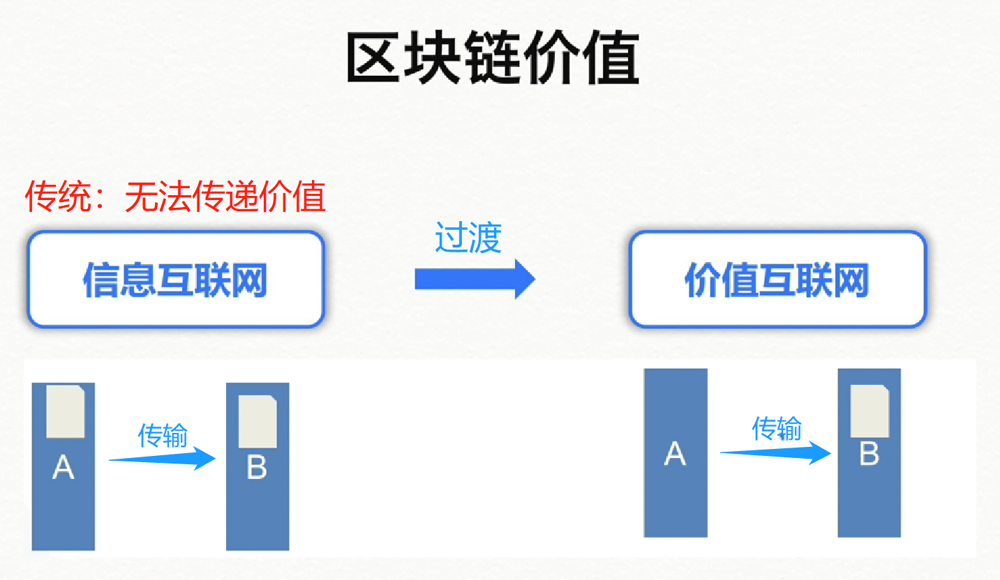

​         而在区块链中，恰恰能够**点对点**的解决价值传递的问题。这就是区块链的**第一个价值**所在。

------

**B.** 🚀**阐述这一价值前，我想问大家一个问题：**当你使用支付宝付款，你的信任基础是什么？是**<u>阿里巴巴</u>**这个**企业**，这个**品牌**，还是他背后运行的代码？

> 我想你内心的答案显而易见 [🐕doge]
>
> 是的，99.99999%的人信任的是品牌，企业，组织而非代码

【信任人或组织的代价是什么？】

> 人心叵测，想要打造出一个让人信任的企业或者品牌，往往需要与时间和巨额投资赛跑~ ~ 具市场调研，通常至少需要半个爽！！！可以说，成本极其昂贵。Σ(っ °Д °;)っ

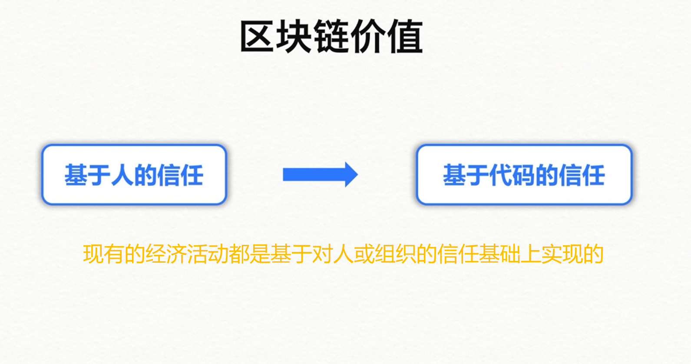

​         **而**在区块链的世界中，代码就代表着**法律**，它能够做到代码活动的**公开透明性**，从而使执行者在基于代码信任的基础上，实现经济活动。乍一听，这还蛮高深的，其实说白了，区块链就是个**“透视镜”**，在这里，没有暗箱操作，也没有小黑屋，大家都能够监视经济活动的执行。

------

**C.**🚀关于区块链的**其他价值**，在这里我不过多赘述，后面的教程会详细展开，朋友们直接上图！

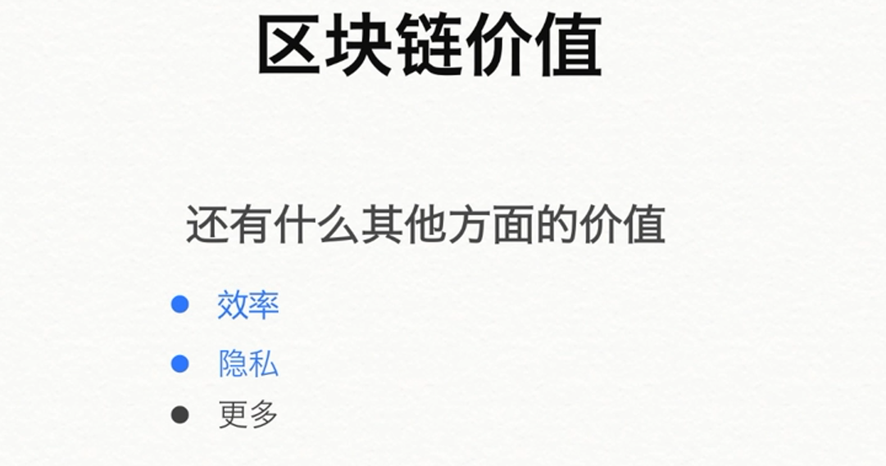

------

## 2. 不仅仅是数字货币——区块链的应用

[^前言]: 区块链技术作为一种**新型创造信任**技术，实现了点对点（P2P）的价值传递，受到了很多行业的追捧，那么就目前区块链发展来看，区块链可以应用的行业有哪些呢？

### 💎 区块链应用-行业

1. 🚀**银行业：**银行是一个安全的存储仓库和价值的交换中心，而区块链作为一种数字化的、安全的以及**防篡改的**总账账簿可以达到相同的功效。

   

   ------

   

2. 🚀**医疗业：** 一直以来，医疗机构都要忍受无法在各平台上**<u>安全地共享数据</u>**。数据提供商之间更好的数据合作意味着更精确的诊断，更有效的治疗，以及提升医疗系统提供经济划算的医疗服务的整体能力。区块链技术可以让医院、患者和医疗利益链上的各方在区块链网络里**共享数据**，而不必**担忧**数据的安全性和完整性。

   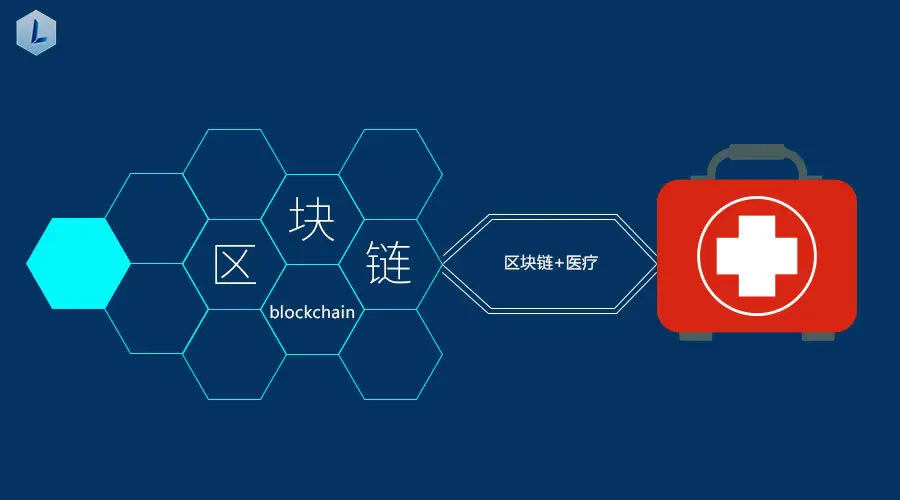

   ------

   

3. 🚀**物联网行业：**使用区块链技术形成一个物联网设备去中心化网络的主体。根据部分网站，作为**匿名的去中心化的**点对点遥感技术，区块链可以成为大量设备的一种**公共账簿**，它们将不再需要有一个中央化的 路由在他们之间居中交通。在没有了中央控制系统来验证之后，设备将能够在它们之间互相匿名传输，并管理软件的更新、错误，或者进行能源管理。

   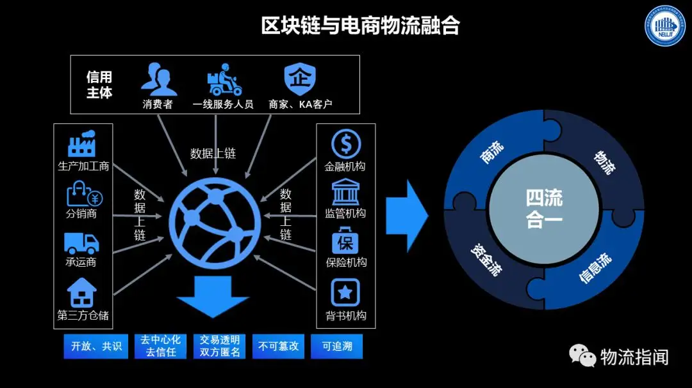

​              <u>**不理解没关系，举个例子：区块链+物流链**</u>

* 以一直受假冒伪劣产品困扰的茅台酒的防伪技术为例，2000年起，其酒盖里有一个唯一的*RFID标签*，可通过手机等设备以***NFC***方式读出，然后通过茅台的APP进行校验，以此防止伪造产品。 **乍一看**，这种防伪效果非常可靠。但2016年还是引爆了茅台酒防伪造假，虽然通过NFC方式验证OK，但经茅台专业人士鉴定为假酒。后来，在**国酒茅台防伪溯源系统**数据库审计中发现***80万条假***的防伪标签记录💔，原来防伪技术公司人员参与伪造。随后，茅台改用**安全芯片防伪标签**。**然而**，这里暴露出来的痛点并没有解决，即防伪信息掌握在某个中心机构中，有权限的人可以**任意**修改。因此2017年05月贵阳数博会上，马子哥就建议**茅台防伪使用区块链**，**那么区块链和物流链的结合有什么优势呢？**

  ------

  

* 🚀以上问题在本节**最后**公布答案，可以自己先思考一下哦😊！！

​       

4. 🚀**房地产行业：**买卖产权的过程中的**痛点**在于：交易过程中和交易后缺乏透明，大量的文书工作，潜在的欺诈行为，公共记录中的错误等等，而这些还仅仅只是一部分。区块链提供了一个途径去实现无纸化和快速交易的需求。房地产区块链应用可以帮助记录、追溯和转移地契、房契、留置权等等，还给金融公司、产权公司和抵押公司提供了一个平台。区块链技术致力于**安全保存文件**，同时增强**透明性**，**降低成本**。

   

   

   ------

   

5. 🚀**汽车业：**早在2017年，就有**大佬**宣布合伙使用区块链建立一个概念证明来简化汽车租赁过程，并把它建成一个**“点击，签约，和驾驶”**的过程。未来的客户选择他们想要租赁的汽车，**进入区块链的公共总账**；然后，坐在驾驶座上，客户签订租赁协议和保险政策，而区块链则是同步更新信息。 这不是一个想象，对于汽车销售和汽车登记来说，这种类型的过程也可能会发展为现实。

   

   ------

   

6. 🚀保险业，云存储，股市交易，学术界，能源管理....**只有你想不到的，**

   **没有区块链技术不能涉及到**的行业👍👍👍

### 💎 区块链应用-具体经典实例

1. **电子身份证（版权保护）：**将“申请人+发布时间+发布内容”等**版权**信息加密后上传，版权信息用于**唯一区块链ID**，相当拥有了一张电子身份证。

   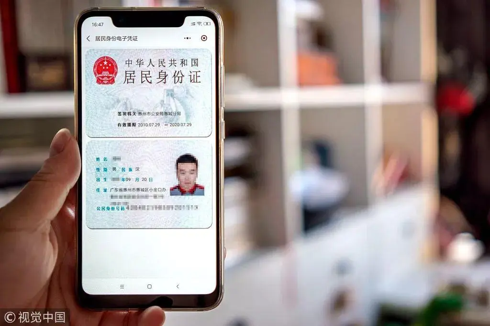

   

   2. **腾讯公益寻人链（信息共享）：**区块链本身就是需要保持各个节点的数据一致性的，可以说是**自带信息共享**功能；其次，实时的问题通过区块链的**P2P**技术可以实现；最后，利用区块链的**不可篡改和共识机制**，可构建其一条**安全可靠**的信息共享通道。

      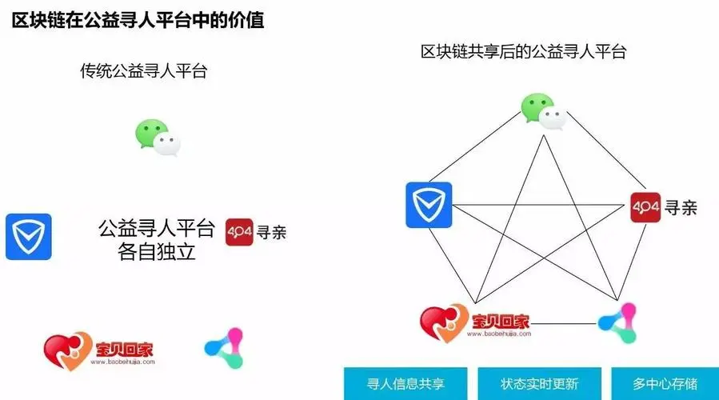

3. **茅台酒防伪溯源（区块链+物流链）：**上文说到在2017年05月贵阳数博会上，马子哥建议**茅台防伪使用区块链**。**咱们书接上文[doge🐕]:**

   1. 🚀**去中心化：**区块链没有中心化节点，各节点是平等的，掌握单个节点无法实现修改数据；需要掌控足够多的节点，才可能伪造数据，***大大提高伪造数据的成本***。

   2. 🚀**透明可追踪：**区块链天生的开放、透明，使得任何人都可以***公开查询***，伪造数据被发现的概率大增。

   3. 🚀**不可篡改和伪造：**区块链的数据不可篡改性，也保证了已销售出去的产品信息已永久记录，无法通过简单复制防伪信息蒙混过关，实现二次销售。

   4. 🚀**数据安全及信用的自我建立：**物流链的所有节点上区块链后，商品从生产商到消费者手里都有迹可循，形成完整链条；商品缺失的环节越多，将暴露出其是伪劣产品概率更大。

   >  
   >
   > Soga！马子哥诚不欺我！！果然是聪明人！(*^_^*)
   >
   > 有了区块链，再也不用当冤大头喝假酒了！

   ------

4. **数字人民币DECP（P2P价值传递）：**全称***Digital Currency Electronic Payment***，DC指的是数字货币，EP指的电子支付。早在2014年，央行便开始着手DCEP的研究。2020年已在深圳、苏州、雄安、成都试点。从性质上看，DCEP，属于法定货币，是数字化的纸币，和人民币金额是1:1的关系，没有投资和投机价值。

   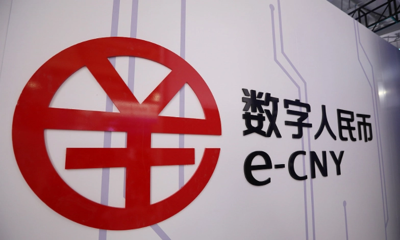

   

5. **阳光链（区块链慈善）：**区块链的**去中心化，不可篡改和可溯源**与与慈善行业的需求场景高度吻合，阳光链成为了区块链技术在慈善行业的典型应用。

   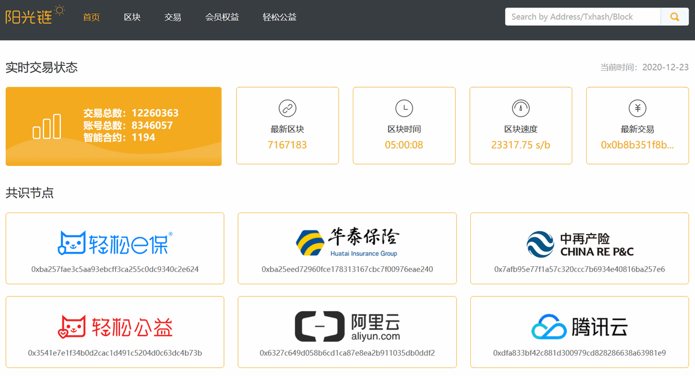

6. **跨境支付（跨境支付+区块链）：**

   1. 🚀**传统跨境支付：**跨境支付涉及多种币种，存在汇率问题，传统跨境支付非常依赖于第三方机构，大致的简化模型如下图所示，存在着两个问题：

      1. 流程繁琐，结算周期长
      2. 手续费高

      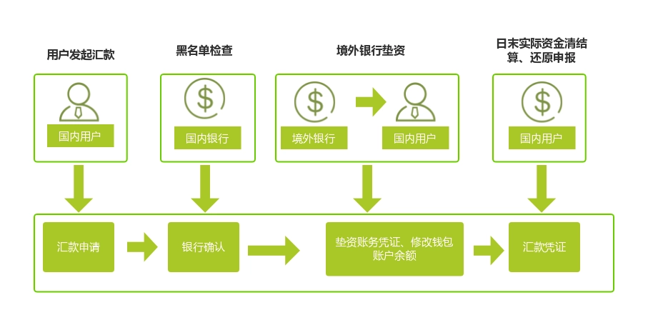

      > 这些问题的存在，很大原因还是**信息不对称**，**没有建立有效的信任机制**。

   2. 🚀**跨境支付+区块链：**区块链的引入，解决了跨境支付信息不对称的问题，并建立起一定程度的信任机制。

      1. **效率提高，费用降低：**接入区块链技术后，通过公私钥技术，保证数据的可靠性，再通过加密技术和去中心，达到数据不可篡改的目的，最后，通过P2P技术，实现点对点的结算；去除了传统中心转发，提高了效率，降低了成本（也展望了普及跨境小额支付的可能性）。

      2. **可追溯，符合监管需求：**传统的点对点结算不能不规模应用，除了信任问题，还有就是存在监管漏洞（点对点私下交易，存在洗黑钱的风险），而区块链的交易透明，信息公开，交易记录永久保存实现了可追溯，符合监管的需求。

      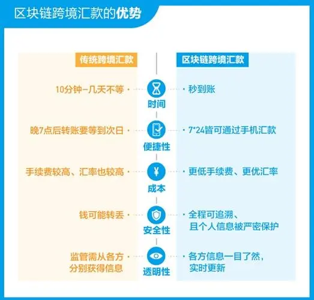

> 看了这么多实际案例，不管你看明白了几个，是否对区块链的特
>
> 点与优势有了进一步的了解呢 **QAQ**？
>
> 让我来考考你吧！准备好了吗🙆‍

### **🚀请回答出区块链的至少四个特点**

[^&Tips]: 答案就在上文中，注意文中高亮与加粗区域

[^以上部分材料来自于]: [区块链应用场景有哪些？区块链技术具体应用盘点](https://blog.csdn.net/bdzh135/article/details/79926569)
[^以上部分材料来自于]: [区块链七大应用场景](https://blog.csdn.net/u010199413/article/details/100564767?ops_request_misc=&request_id=&biz_id=102&utm_term=区块链应用场景&utm_medium=distribute.pc_search_result.none-task-blog-2~all~sobaiduweb~default-2-100564767.nonecase&spm=1018.2226.3001.4187)
[^以上部分材料来自于]: [区块链应用场景与案例分析](https://blog.csdn.net/lsqzedu/article/details/109322475?spm=1001.2101.3001.6650.1&utm_medium=distribute.pc_relevant.none-task-blog-2~default~CTRLIST~Rate-1-109322475-blog-100564767.pc_relevant_antiscanv2&depth_1-utm_source=distribute.pc_relevant.none-task-blog-2~default~CTRLIST~Rate-1-109322475-blog-100564767.pc_relevant_antiscanv2&utm_relevant_index=2)

------

## 3. 区块链风云历史（重点）

>  **【为什么】要了解区块链的历史 ?**
>
> 帅气的 **Science_Jun【doge🐕】**曾言：历史是一面镜子，它照亮现实，也照亮未来（好吧，其实是赵鑫珊老师说的~）
>
> 恰如此言之意：了解一门技术的发展历程，尤其是区块链这位万众瞩目的后起之秀，正是起着**继往开来以明志**的作用。（好吧摊牌了，其实也是为了和你不了解区块链的朋友或同事**吹牛逼** 🐂）但这不是重点！**重点**是如果你和懂区块链的人聊了起来，当他谈起**v神**的传奇历史，你的脑海里却只浮现出四个字：**v神是谁....？**这不得尴尬地脚趾抠出三室一厅了...
>
> 

[^前言]: 区块链发展的历史可不是简简单单就能描述完的，真要彻头彻尾的讲完整，我想大家需要准备一下睡衣睡裤了Σ(っ °Д °;)っ所以在此之前我需要向大家提出区块链绕不开的名人，以便大家快速鸟瞰这区块链发展的长河

### 💎中本聪&Wei Dai —— 灵光乍现的渊源

> 早在2008年11月1日，一个名叫**中本聪**的极客为了表达对政府肆意制造通货膨胀的不满，发表了一篇名为**<u>《比特币：一种点对点式的电子现金系统》</u>**的论文，这篇文章，标志了区块链技术的正式诞生。
>
> 然而，很多人不知道的是，其实区块链的底层构想并不是由中本聪最先提出。早在比特币诞生的前10年，就由一位名为**Wei Dai**的华人密码学家放在了他的一个名为**B- Money**的研究之中。

#### ⭐【神秘人中本聪】

 区块链世界里最神秘的人，非比特币发明者中本聪莫属。

现在唯一可以确定的是，中本聪是比特币的第一个矿工。

* 2009年1月3日，中本聪挖出了第一个比特币区块，也称<u>创世区块</u>，并获得了50个比特币的系统奖励。
* 2009年2月11日，中本聪注册了P2P Foundation，资料显示，中本聪是一个43岁的日本男性，至于该信息是真实的，还是中本聪的障眼法，不得而知。当天，中本聪在上面声称，他开发了一个叫比特币的电子现金系统，并给出了开源代码。
* 2010年12月5日，在维基解密泄露美国外交电报事件期间，比特币社区呼吁维基解密接受比特币捐款，以打破封锁。为保护襁褓中的比特币，中本聪义无反顾地站出来，<u>坚决反对捐款</u>，他的理由是：比特币还很弱小，经不起冲击和争议。
* 2010年12月12日，中本聪在比特币论坛中发表了最后一篇文章，提及了最新版本软件中的一些小问题。此后，仅通过电子邮件与比特币核心开发团队的少数人保持联系，不再公开发表任何言论。
* 2011年4月26日，中本聪在一封电子邮件中写道：“我已转移到其他事物上去了。”从此，中本聪的电子邮件关闭了。
* 2014年，Newsweek发布新闻，表示自己找到了中本聪本人——多利安·中本聪；9月13日，中本聪突然发帖否认此事，随后，多利安·中本聪也表示，自己并不是比特币创始人中本聪。
* 2018年11月29日，时隔多年，“中本聪”账号发布了仅有一词的状态<u>“Nour”</u>，引起比特币社区热议，但不知是黑客入侵还是真的中本聪在操作。

现在，虽然有无数研究者、情报人员调查过他的真实身份，但至今未得到核实。

------

【💎**讲点有意思的，坊间关于中本聪的猜测：】**

**1、外星人**

有人大胆猜想，是不是像科幻电影里常见的剧情，一个月黑星高的夜晚，外星人中本聪乘坐飞碟，悄无声息地来到地球，把比特币的开源代码传到互联网上。当他的光荣使命完成后，又选择了默默地离开，不带走一片云彩。

**2、未来穿越者**

有人开脑洞地认为，中本聪可能是未来人，为了平衡目前经济社会的资本，穿越到了这个时代，创造了比特币。

**3、已离世**

有人猜想，中本聪有可能得了重病或者遭遇意外，在2011年便去世了，因此中本聪掌握的比特币私钥也一起消失了，100多万个比特币将永久沉睡。

**4、一个团队**

有人研究了比特币的代码，认为太精妙了，不像单个人所为，更像一个团队写的。可能这个团队都是顶尖人才，创造比特币是一个长久以来的计划，酝酿了几年时间，最后才慢慢成型的。

**5、英国人**

理由是，他会用很溜的英式英语，他的活动时差显示他主要生活在美国，加上他取了一个日本名字，所以说，他是披着日本外衣在美国生活的英国人。但这些特征，也可能是中本聪用的障眼法。

最后，你可能会好奇地问，有了这么伟大的成就，[有了巨大的财富](http://mp.weixin.qq.com/s?__biz=MzUyNzE4MDM2MA%3D%3D&chksm=fa01d435cd765d2337c5f8c0b3c39cef62239509427f80e70ab129e2b2cd497fc6dca6dd638a&idx=2&mid=2247492370&scene=21&sn=8ab204a6c437a83052938abbc68e9889#wechat_redirect)，为什么中本聪还要隐藏自己呀？

**其中一个猜测是，中本聪对去中心化的理念非常执着，他觉得只有自己消失，比特币的系统才会是安全的去中心化。**

不管中本聪是“他”，是“他们”，还是“它”，中本聪已经改变了这个世界，**每一个为比特币做过贡献的或者正在做贡献的人，其实都是中本聪！**

[^想了解更多的同学来这吧~]: [中本聪_百度百科 (baidu.com)](https://baike.baidu.com/item/中本聪/5740822?fr=aladdin)
[^中本聪的那篇论文，实在有兴趣的同学可以观摩(￣▽￣)]:   [《比特币：一种点对点式的电子现金系统》]([bitcoin.pdf](https://bitcoin.org/bitcoin.pdf))
[^以上部分内容取自]: [科普|中本聪到底是谁？](https://blog.csdn.net/mrRqAEr7ci9s2v0/article/details/113285330)

🚀大家都知道中本聪提出了区块链技术，而知道**Wei Dai**的人却寥寥无几，那么**Wei Dai**到底是何方神圣？

🚀说起**Wei Dai**，那么便绕不开一个神秘的组织——**密码朋克**！

------

### 💎密码朋克——区块链的重要精神先驱

> ​         在比特币之前，区块链的很多基础技术概念其实都来自于一个于1993年成立的神秘邮件列表组织——**密码朋克（Cypherpunk）**。
>
> ​         密码朋克是一个**提倡使用强加密算法来保持个人隐私安全的“极客组织”**，其成员有很多我们如今耳熟能详的计算机大佬们，包括维**基解密的创始人朱利安·阿桑奇、“万维网之父”蒂姆伯纳斯·李、Facebook的原创始人肖恩·帕克等等，当然，也包括Wei Dai和中本聪。**
>
> ​         早在上个世纪90年代末，密码朋克就诞生了很多对日后区块链影响深远的基础构想和技术，包括亚当·贝克发明的**PoW算法**、斯图尔特·哈伯和斯科特·斯托内塔提出的用时间戳方法保证数字文件安全的协议，Wei Dai所提出的匿名、分布式的电子加密货币系统等。**因此从某种程度上来说，区块链技术其实并不是中本聪灵光乍现的原始发明，而是对密码朋克群组一系列技术的集大成。**
>
> ​         其中，Wei Dai所提出的**B-money构想**可以说是**区块链的重要精神先驱**。[B-money可以理解为用B换钱，这样就好记了(*^_^*)]
>
> ​          **B-money 的设计在很多关键的技术特质上与比特币非常相似。**它率先提出了分布式账本的理念，要求所有的账户持有者共同决定计算量的成本并就此达成一致意见，并首次引入了**PoW机制、数字签名、P2P交易、智能合约、身份验证**等概念。
>
> ​         但作为一个并不完备的构想，当时的B-money在很多内容上都是浅尝辄止，在共识模型、奖惩机制、货币的创造等方面没有提出详细的解决方案，因此只是停留在了设计层面并没有付诸实践，在当时也没有引起很大的水花。
>
> ​         一直到2008年，中本聪**基于前人的各种想法开始设计比特币**。整理成文后他首先将文章发给了**PoW算法**的发明者亚当·贝克，亚当·贝克看完后发现比特币的运行机制跟Wei Dai多年前提出的B-Money有很多相似之处，于是建议中本聪要引用一下B-Money。**接着，中本聪去认真研读了B-Money后也惊奇地发现早在十年前Wei Dai就和自己有了几乎一样的想法，同时又借鉴了B-Money里的一些机制对比特币进行了完善。**

⚽想要进一步了解B-money这一**创世的构想**，可以去参考这篇文章 [WeiDai的B-Money，也许是比特币的初稿](https://www.panewslab.com/zh/articledetails/D44115590.html)

#### ⭐【纪念WeiDai】

📕很可惜，**Wei Dai**到如今都仍是以神秘人的身份出现在世人目光范围里，且只有极少数人知道他，或许这就是属于一代极客的浪漫——<u>“事了拂衣去，深藏功与名”</u>。B-money是密码朋克社区对研发数字世界中的独立自主的货币的又一次探索，2013年，Vitalik Buterin一手构建的以太坊（Ethereum）最小单位**Wei**，便以他的名字命名。

* 向勇于探索的前辈致敬
* 知道他你就可以和你的区块链朋友一起吹🐂了[doge]

### 💎Vitalik Buterin——鲜衣怒马少年时

**简介：**我想用**鲜衣怒马少年时**来描述V神比较合适：

* 5岁时便开始接触编程语言

* 7岁独自创建了一个叫“兔子百科全书”的复杂文档

* 12岁起就用C++编写给自己玩的小游戏

* 13-16岁青春期网瘾少年，沉迷**魔兽世界**

  （终于找到和我一样的经历了/(ㄒoㄒ)/~~）

* 网瘾少年到一代神话的奇幻转折 

* 17岁从父亲口中听说到比特币

* 省略一万字..........................

* 25岁身价上百亿美元

  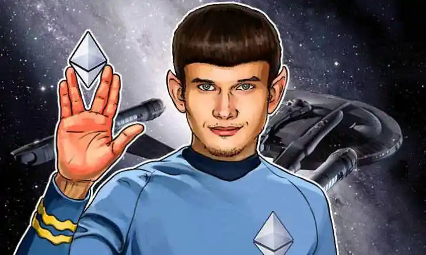

> Vitalik Buterin，就是我们常说的V神，区块链世界传奇⼈物，⾝家⼀度超过了巅峰时期的马云。
>
> Vitalik Buterin的成功来⾃两个⽅⾯：⼀是从⼩就展现出来的过⼈智商和⾮凡天赋，他只花了⼏个⽉的时间，就学会了加拿⼤当地的语⾔，甚⾄在⾝边的伙伴还懵懵懂懂的时候，Buterin已经⽤他4岁时收到的礼物——⼀台个⼈电脑撰写⾃⾏计算的程序了；另⼀⽅⾯则是碰上了难得⼀遇的好时机——区块链时代的到来！
>
> Vitalik Buterin，1994年出⽣于俄罗斯，5岁的时候，⽗母离婚，跟随⽗亲移民到了加拿⼤。他⾃⼩在数学上就有很⾼的天赋，在⼤部分⼈九九乘法表还没背全的时候，Buterin的三位数⼼算速度已经是同龄⼈的两倍。在⼩学三年级的时候，他便被安排进了“天才⼉童班”，学习数学、编程和经济学等科⽬。
>
> 7岁的时候，Buterin创建了⼀个叫做”兔⼦百科全书“的复杂⽂档，这是⼀个由兔⼦组成的⼩世界，但世界⾥的规则符合⾮常严格的公式，⾥⾯全是数学，图表和计算。Buterin读五六年级的时候，很多⼈认为他是数学天才。12岁起，Buterin已经可以⽤程式语⾔C++撰写简单的游戏给⾃⼰玩了。
>
> 这样⼀路成长下去，Buterin或许就成为⼀名优秀的程序员了，但事情往往却⼀波三折。在13岁到16岁的时候，Buterin沉迷于《魔兽世界》中，摇⾝⼀变成了⼀个⽹瘾少年，经常⼀玩游戏就是⼀整天。直到
>
> 【<u>**有⼀次暴雪在版本更新中，取消了Buterin最喜爱的⾓⾊——术⼠的“⽣命虹吸”技能，使得Buterin悲痛欲绝，并多次发邮件和在官⽅论坛⾥联系了暴雪的⼯程师，要求他们还原这个技能，但是得到的回复都是出于游戏平衡才这么做的，不能恢复。**</u>
>
> <u>**Buterin对这种中⼼化组织主导⼀切的状况产⽣了不满。在互联⽹游戏⾥，最⼤弊端就是⼀切由开发商说了算，⽽玩家只能选择被动接受，或者离开。所以，他选择了放弃玩魔兽。**</u>】
>
> 2011年，17岁的Buterin从他⽗亲那听到了⽐特币，⼀开始他和当时的⼈们⼀样，并不认为⽗亲兴奋提及的数字货币有任何实际价值。Buterin的⽗亲是⼀家区块链孵化器Blockgeeks Labs的**联合创始⼈**。这位送给他第⼀台电脑、买给他电脑科学书籍的⽗亲，也是⼀路以来⿎励他探索的启蒙导师和伙伴。<u>在他⽗亲宣扬下，Buterin**开始认识到了⽐特币的真正意义所在，并被区块链技术的去中⼼化属性给深深地吸引了**。</u>
>
> 基于对⽐特币及区块链技术的浓厚兴趣，Buterin开始在⽹络上撰写相关的⽂章，主要涉及到区块链技术以及潜在的社会影响，彼时的他还未满18岁。Buterin的⽂章很受欢迎，每篇帖⼦⼤概能得到5个⽐特币（时价4美元左右）的“打赏”。2011年9⽉，Buterin以联合创始⼈以及主要撰稿⼈的⾝份会同罗马尼亚程序员Mihai Alisie创建了“⽐特币杂志”，这是⼀份实体和在线的出版物，直到2015年被收购前，该杂志积累了⼤概150万名读者。
>
> Buterin19岁时，也就是2013年的时候，被加拿⼤滑铁卢⼤学（计算机专业世界排名第18位）录取，学习计算机科学。<u>但8个⽉后，Buterin便选择了和⽐尔盖茨和扎克伯格⼀样的道路——辍学</u>，毅然踏上了周游世界之路，与世界各地的区块链爱好者交流和互相学习，⽽他的⽗亲对此也是乐见其成。这段时间正值⽐特币第⼀个爆发期，短时间内1btc的价格从⼏⼗美元上涨到1000多美元，这为Buterin带来了⼈⽣的第⼀桶⾦。
>
> 2013年年末，周游世界归来后的Buterin有了些新想法。当时的⽐特币爱好者正在全⼒以赴地为⽐特币增加更多的功能性，打造⽐特币2.0。但Buterin认为，建⽴⼀个全新的编程语⾔才是⽐特币的当务之急。<u>出于安全原因，⽐特币的开⼭⿐祖中本聪⽤了⼀种复杂的脚本语⾔编写了⽐特币协议，然⽽这种语⾔有意地限制了交易的复杂性，也导致了⽐特币⼀直没有开枝散叶，孵化出更多的应⽤。</u>
>
> 针对这种状况，<u>Buterin打算⽤⼀种**通⽤的脚本语⾔**，打造⼀款新的计算平台和新的加密货币，于是他很快就写下了⼀篇⽩⽪书，并在⽂中介绍了以太坊。19岁的Vitalik Buterin给他的好友们发了以太坊⽩⽪书。这款新的⽐特币将基于通⽤的编程语⾔，可以⽤来创建各种各样的应⽤，⽐如社交、交易、游戏……Buterin发给了15个⼈，这15个⼈⼜相继发给了他们的好友。⼀传⼗，⼗传百，Buterin的想法很快就在⽐特币社区⾥获得了⼀致的好评。</u>
>
> 和其他的加密货币⼀样，<u>Buterin决定⽤ICO的⽅式进⾏众筹</u>，⽤户可以⽤⽐特币来预购以太币。以太币的定价是2000个以太币 1个⽐特币，按照当时每个⽐特币600美元的价格，⼀个以太币是0.3美元。
>
> 最终，这次ICO⼀共募集了31,000个⽐特币，即1,800万美元，这让它成为了加密货币历史上价值第⼆⾼的ICO。有了这笔钱，Buterin的团队很快在瑞⼠成⽴⼀家⾮盈利公司Ethereum Foundation。<u>Buterin也因为对⽐特币2.0的发展贡献，从⽽击败了Facebook创始⼈Mark Zuckerberg，获得2014年IT软件类世界技术奖。这个奖项表彰了V神设计发展以太坊（Ethereum）的突出成就。</u>
>
> 2015年6⽉，第⼀款以太坊发布，取名Frontier，所有承诺给早期投资者的以太币被顺利地交付，开发者们也开始在以太坊上编织他们的梦想。两年间，以太坊的出现激活了区块链背后的巨⼤潜⼒：以太币的价格在2017全年翻了85倍；由以太坊奠基的ICO在2017年成为最⽕的资⾦众筹⽅式，全球通过ICO募集了超过40亿美元；
>
> <u>2017年，全球电⼦货币的市场总值从年初的180亿美元暴涨到5600亿美元。</u>

[^ICO]: Initial Coin Offering，首次币发行，源自股票市场的首次公开发行（IPO）概念，是区块链项目首次发行代币，募集比特币、以太坊等通用[数字货币](https://baike.baidu.com/item/数字货币/8159530)的行为。

### 💎**时间节点——区块链的跨时代**

[^前言]: 先前说到V神用他一首创建的以太坊成功开启了区块链2.0时代，那么1.0和3.0都是什么时候呢？其实在先前的内容我都提及过。

1. ***区块链1.0时代（2009-2013）：***

   ⭐标志事件：署名为“中本聪”的匿名人士发表论文《比特币：对等网络电子现金系统》，标志着区块链的世界打开大门。

   ⭐阶段特点：该阶段主要关注数字货币的回报率，而非其应用价值。

2. ***区块链2.0时代（2014-2017）：***

   ⭐标志事件：2013年11月，V神发布了以太坊白皮书，区块链的特性形成了信任基础。

   ⭐阶段特点：为智能合约提供了可信任的执行环境，扩大了对金融领域更广泛的场景和流程进行优化的应用，使得所有金融交易都可以被改造成在区块链上使用。以太坊与比特币的最大区别，是其支持脚本语言应用开发，可以实现智能合约。

3. ***区块链3.0时代（2018-至今）：***

   ⭐标志事件：2017年底起，稳定币USDT的交易开始显著放量，2017年12月，借贷类DeFi项目MakerDAO上线，其中也用到了稳定币的技术。

   ⭐阶段特点：3.0时代是超越货币和金融范围的泛行业去中心化应用，特别是在政府、医疗、科学、文化和艺术等领域的应用。

### **🌙跨时代总结**

​        **实际上不难看出，区块链的跨时代实际上就是三种数字货币的诞生与爆发：1.0是最早的比特币（BTC）创世，开辟区块链时代，为天才少年V神的横空出世奠定了时代基础；2.0是以太坊（Ethereum）的信任机制建立，区块链的无限可能性在此萌芽，为USDT的交易奠定了信任基础；3.0则是泰达币（USDT）交易的放量增长，为后续区块链技术的衍生提供了价值基础；因此在当今所有交易所我们都可以看到，只有这三种数字货币一直是首页大屏的“不动明王”，并且价值排序是呈阶梯型递减的，在我看来，未来也难以撼动他们的地位。我们是不是可以推断：能够越早占据时间长河的前瞻位置，也就能越早地掌握经久不衰的财富密码。因此，在持久学习的道路上，掌握技术能够让你站稳脚跟，而回望历史则是站在时代巨人的肩上去目睹苦难和机遇并存，去仰望星空，开拓视野，进而去探索宇宙；这，就是为什么我要去介绍区块链发展历史的真正缘由。**

### **🌙畅想未来**

**畅想一下区块链4.0时代的到来是因为什么？**

[^部分内容来自于]: [科普 | 比特币创始人中本聪是谁？](https://blog.csdn.net/mrRqAEr7ci9s2v0/article/details/113285330)

## 4.【挖矿】到底是什么——区块链的核心技术

### 💎挖矿，到底是什么？（引言）

**简短概括：**挖矿——就是通过贡献计算机的计算力来换取虚拟货币的奖励。这么说确实略显抽象，别着急，咱先走为上。

提起挖矿，大家最近是否注意到一个现象：**电脑显卡的价格暴涨，**迎来了十几年来的一次价格高峰；俗话说，物以稀为贵，供求关系不平衡才会如此，那么谁是罪魁祸首呢？毫无疑问——矿机！挖矿需要矿机来作为硬件基础，而矿机的核心性能取决于显卡，矿工们为了更好地争夺虚拟货币的奖励，就不得不买算力更加强大的矿机，也就意味着更好的显卡，消耗更多的电费。这些，就是在挖矿中最重要的**物理基础。**

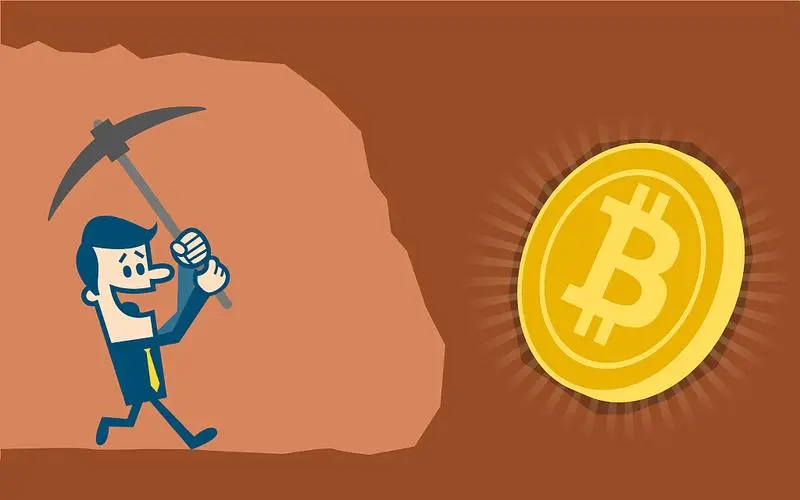

那么，挖矿的物理基础有了，挖矿的规则是什么来决定的呢？答案就是PoW工作量证明机制，请随我来~

### 💎共识机制——区块链的信任基础

#### A. PoW（Proof of Work）工作量证明机制

[^前言]: 有一家创业公司，某天“至高无上”的老板心血来潮布置了个工作任务：推算出256个公司人员每天上厕所的次数，只要有结果不管对错都可以去问他是否推算正确，并许诺谁能够抢先全部推算正确，就给谁加工资！（员工们此时内心一百个无语，这是正常人能想出来的事儿吗？有的人只知道自己一天上厕所的次数，有的人还知道身边人的次数，更多的只能靠猜，卑微的打工人罢了/(ㄒoㄒ)/~~）经历了千辛万苦，奇迹诞生了！聪慧过人的张三用其独到的方法抢先全部推算正确，得到了老板的加工资奖励o(*￣▽￣*)ブ

上面的例子并不是题外话，相信聪明的你早已窥见了端倪，这实际上就是PoW机制的过程简述。

📕***PoW：*** 也称挖矿，它是需要完成一定的工作量（Hash计算）来证明获取记账权。它是最早应用在区块链技术上的共识机制，也是区块链应用领域使用最为广泛、最为成熟的共识机制。比特币区块链系统就是使用PoW共识机制。

**📕PoW算法在区块链实现过程：**

1. 先定义一个固定的256位长度初始数，比如：长度为256位的 0000…0001 （**相当于32字节，64字符，一字节为8位，一字符为4位**）

2. 设置难度系数值，比如：如果难度系数定义为前面4个0，即16位长度（0000 0000 0000 0001 = 4个字符= 2个字节）

3. 按照难度系数值进行**移位操作**，将Hash工作量值扩大， 向左移 （256-难度系数N位）比如： 将初始数 0000.....0001 向左移（256-16位）得到： 0000 0000 0000 0001 0000 …0000.

4. 将随机数Nonce递增加1再加上区块头（Block Header）Hash值拼接，然后进行SHA256 Hash运算。

5. 将计算结果值与当前难度系数目标值做对比，**如果当前计算值大于难度系数条件值，即继续递增Nonce值再进行下一次的SHA256 Hash运算**，直到计算出的结果Hash值少于目标值，则才认为解题成功，此次的工作量证明完成并获得记账权，然后进行对交易区块进行打包确认并广播给全节点。

   

   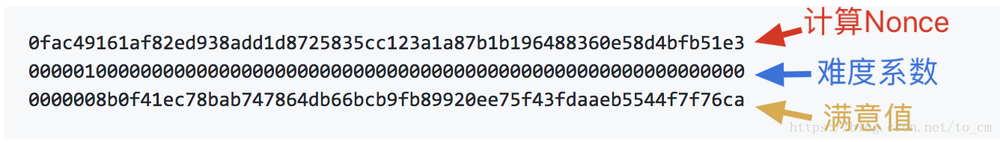

[^什么是区块头（Block Header）？]: 区块头是工作量证明的输入，一个区块包含有区块头和区块交易数据，区块头是一串Hash值。
[^Coinbase]: Coinbase成立于2012年，美国比特币和其他数字货币交易平台。
[^Nonce]: Nonce是Number once的缩写，在密码学中Nonce是一个只被使用一次的任意或非重复的随机数值。

##### 📕简单理解五步曲：

Looping （循环）{

1. 准备初始数据
2. 设置难度系数
3. 通过SHA256 对数据进行Hash
4. 将Hash转成大整数（big.Int）
5. 将大整数与难度系数目标值比较。

}

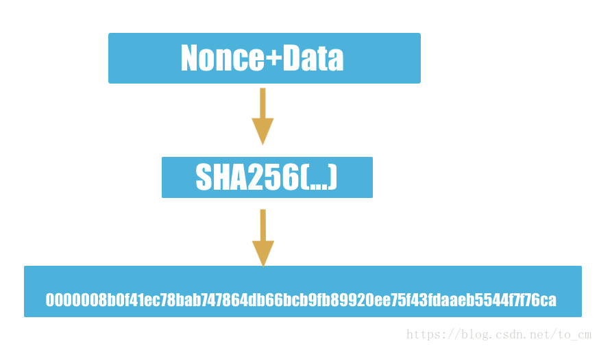

📕***公式表达：***
$$
SHA256 ( Nonce + blockheader ） <  目标值的难度系数
$$
📕***优点：***

1. 完全去中心化；
2. 节点自由进出，有利于节点网络扩大；
3.  用户的参与度与信任度高，对于用户来说实现真正的公平，公正竞争。

📕***缺点：***

1. 最大缺点就是造成的**资源浪费**，争夺记账权需要不停地循环计算哈希值；
2. 达成共识的周期过长，**导致产生新区块效率比较低**，大概每10分钟才产生一个新区块，这不适于商业应用。

#### B. PoS机制（Proof of  Stake）权益证明机制

[^前言]: 在2012年，由加密货币点点币的创始人Sunny King 为了解决PoW中资源浪费的缺点而提出的新的共识概念，他在基于比特币PoW的框架基础上实现了新的共识机制PoS，并最初被应用在点点币区块链系统上。

##### 📕***工作原理：***

PoW是通过计算工作量来获得记账权，而在PoS中即转变为资本证明，它根据每个节点所拥有代币数量的比例和持币时间来通过**算法按等比例地降低节点的挖矿难度**，**从而提高了寻找满足难度随机数的效率，缩短达成共识所需的时间**，因此拥有的币的时间越久和数量越多，它获得的记账的概率就越大。类似于企业的股东制，占有股份多的，它拥有的决策权就越重。

PoS仍然需要网络中的节点进行PoW挖矿运算，因此，PoS机制并没有从根本上解决PoW机制难以应用于商业领域的问题。

📕***公式表达：*** 
$$
SHA256 ( Nonce + blockheader ） < 目标值的难度系数/综合（拥有代币数量的比例和持币时间）
$$

[部分内容取自]: https://blog.csdn.net/to_cm/article/details/82765861	"区块链共识机制"
[部分内容取自]: https://blog.csdn.net/to_cm/article/details/82828144	"深入理解PoW共识"

📕***优点**：*

1. 大幅缩减了参与验证和记账的数量；
2. 提高交易吞吐量；
3. 减少交易验证达成共识时间。

📕***缺点**：*

1. 记账权被掌握在少数被指定的节点上。
2. 参与度不够高，缺乏一定的代表性，显失公平。

### 💎密码学——区块链构筑的底层（概览）

#### A.Hash算法

能任意长度的二进制值映射为较短的固定长度的二进制值（Hash值），并且不同的明文很难映射为相同的Hash值。

主要有[MD5](https://en.wikipedia.org/wiki/MD5)和[SHA256](https://en.wikipedia.org/wiki/SHA-2)。其主要特点是**正向快速，逆向困难，输入敏感，冲突避免，**这些特性能够在区块链网络中发挥巨大的价值。

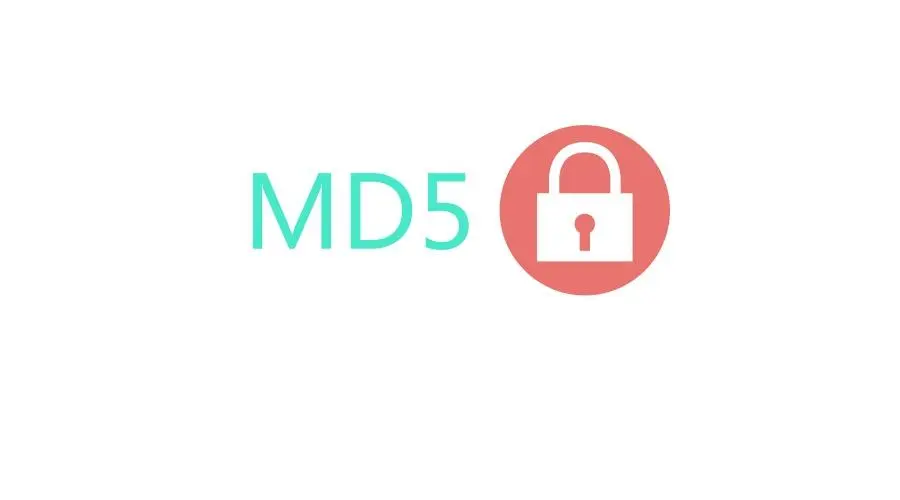

#### B.对称和非对称加密

对称加密：就是采用这种加密方法的双方使用方式用**同样的密钥进行加密和解密**。主要算法有<u>DES、AES、Blowfish、IDEA、RC5、RC6</u>等。

非对称加密：指加密和解密使用**不同密钥的加密算法**，也称为公私钥加密。主要算法有[RSA](https://baike.baidu.com/item/RSA)、[Elgamal](https://baike.baidu.com/item/Elgamal)、背包算法、Rabin、D-H、[ECC](https://baike.baidu.com/item/ECC)**（椭圆曲线加密算法）**。

[^Tips]: 在后面的课程中会详细展开~

#### C.PKI体系

[PKI](https://baike.baidu.com/item/%E5%85%AC%E9%92%A5%E5%9F%BA%E7%A1%80%E8%AE%BE%E6%96%BD/10881894?fromtitle=PKI&fromid=212376&fr=aladdin)是公钥基础设施，我们利用此在不安全的网络中构建了安全服务，从而让互不相识的人们可以安全的通信。

## 5. 辩证思维看待区块链，为什么要去学区块链技术？

> 个人理解与看法，将持续更新

​        每一次革新技术的诞生，都代表着这个世界需要做出一些改变——区块链的诞生，是一代年轻人对于这个时代的反抗与革命。电影《让子弹飞》中张麻子上任鹅城的那句话我记忆犹深<u>**“公平，公平，还tm的是公平！”**</u>。是的，越来越多的年轻人经历不公平，越来越多的年轻人开始追求公平，反思不公平的缘由。这世界上绝大部分财富都掌握在前百分之一的富人手中，而留给新一代年轻人的机会越来越少，可能性也越来越小。在不断自我审问的过程中，可以发现，<u>追求公平绝不仅仅去依靠双手劳动，更需要靠智慧和选择</u>。我很认同这样一句话：“苦难从来不值得被歌颂，如果不是迫不得已，谁会愿意遭受苦难？”是的，在【跨时代总结】中我提到，苦难是和机遇并存的，因此学习和思考，永无止境。

### 💎怎能无动于衷？

​         区块链，毫无疑问将成为未来的趋势，并且这门技术的应用性，完完全全的符合【社会主义核心价值观】。**2022，正是区块链的元年。**正如十来年前的互联网革命一般，那时候学习java，了解java的人并不多，但正是这一波人，窥见了时代趋势，抓住了互联网的巨浪，扬帆起航。而区块链，正隐藏着如此无限的可能性，前瞻时代的浪潮，做好沉淀和学习的提前准备，当巨浪来临，方能**<u>直挂云帆济沧海！</u>**

### 💎不是人人都能成为V神

​        写在最后，也是希望大家能够保持<u>理性思考和时常自省</u>的能力。人人都想成为V神，但他的成功是在天时地利人和的条件下，百年才一遇的个例。妄想平步青云，对于普通人来说未免有些难。区块链技术仍处在初期阶段，发展还不够成熟，道路上还存在着很多阻力。可以看到，以区块链技术为基础的币圈不乏投资失败的普通人，而一夜暴富也仅是个例，究其原因，是他们陷入了富人精心布局的游戏之中，**<u>因为比技术更加复杂的，是人心</u>**。但在这个圈子里，技术高于一切，智能合约的出现，象征着**代码即法律**的不可篡改。而掌握技术，就是在未来掌握着财富！**<u>“路漫漫其修远兮，吾将上下而求索”</u>**，持久学习和思考，不仅仅是为了未来拥有更多的自由，也为了公正的天秤不再倾斜。

## 🚀一些必要的名词解释

[^DeFi]: 即“去中心化金融*（Decentralized Finance）*”，也被称为“开放式金融” 。是以[比特币](https://baike.baidu.com/item/比特币/4143690)和[以太币](https://baike.baidu.com/item/以太币/20857686)为代表的[加密货币](https://baike.baidu.com/item/加密货币/22415288)，[区块链](https://baike.baidu.com/item/区块链/13465666)和[智能合约](https://baike.baidu.com/item/智能合约/19770937)结合的产物

